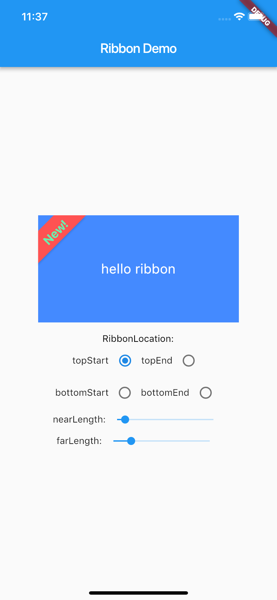

# ribbon_safe

A Ribbon decoration on a widget.

use a Ribbon to decorate a Widget such as container,card...etc.

no clip apply to ribbon title,so check the title length

Installing:

In your pubspec.yaml

dependencies:

ribbon_safe: ^0.0.1

Example Usage:

import 'package:ribbon_safe/ribbon_safe.dart';

Ribbon(

nearLength: nearLength,

farLength: farLength,

title: 'New!',

titleStyle: TextStyle(

color: Colors.greenAccent,

fontSize: 18,

fontWeight: FontWeight.bold),

color: Colors.redAccent,

location: location,

child: )

<!-- 
This README describes the package. If you publish this package to pub.dev,
this README's contents appear on the landing page for your package.

For information about how to write a good package README, see the guide for
[writing package pages](https://dart.dev/guides/libraries/writing-package-pages). 

For general information about developing packages, see the Dart guide for
[creating packages](https://dart.dev/guides/libraries/create-library-packages)
and the Flutter guide for
[developing packages and plugins](https://flutter.dev/developing-packages). 
-->

TODO: Put a short description of the package here that helps potential users
know whether this package might be useful for them.

## Features

TODO: List what your package can do. Maybe include images, gifs, or videos.

## Getting started

This project is a starting point for a Dart
[package](https://flutter.io/developing-packages/),
a library module containing code that can be shared easily across
multiple Flutter or Dart projects.

For help getting started with Flutter, view our
[online documentation](https://flutter.io/docs), which offers tutorials,
samples, guidance on mobile development, and a full API reference.

